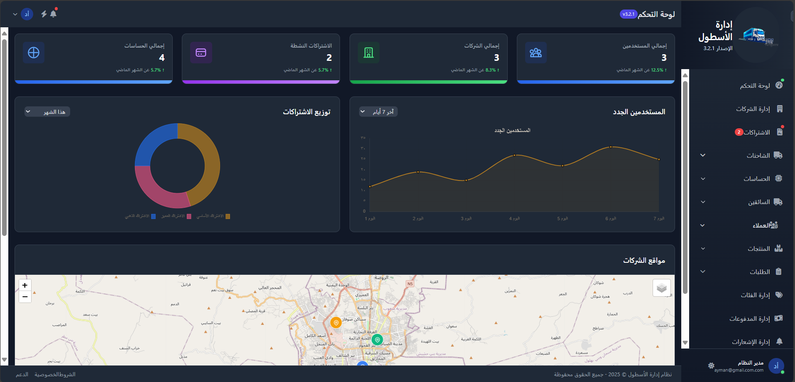
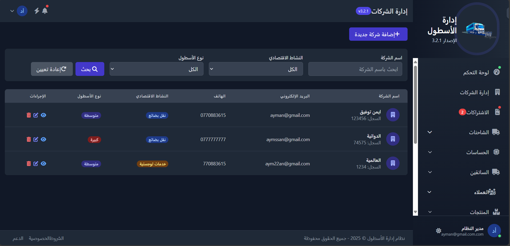
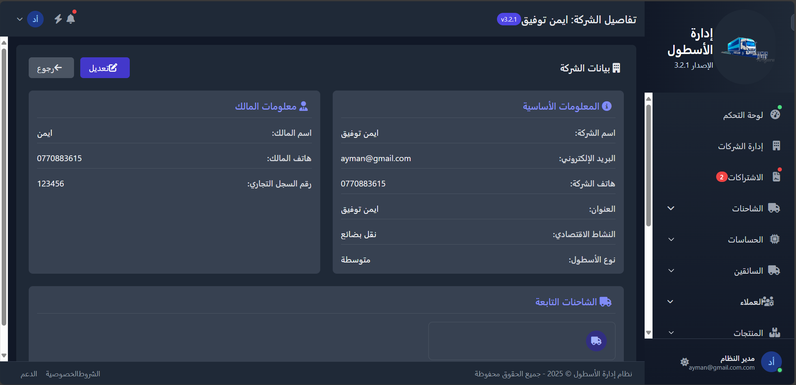
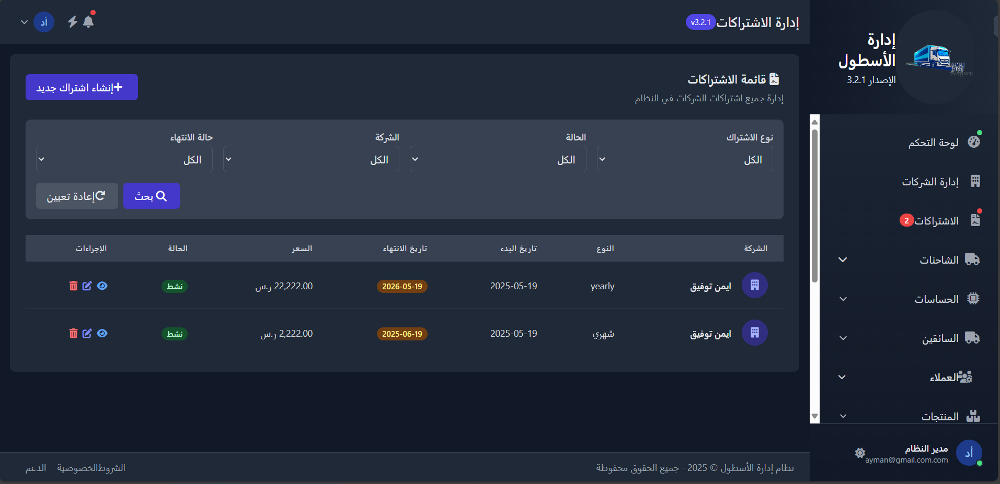

# 🖥️ Yemen Fleet - لوحة تحكم الأدمن

<p align="center">
  
  <br>
  
  
  
</p>

## 🌟 نظرة عامة

لوحة تحكم إدارة نظام **Yemen Fleet** تمكن المسؤولين من:
- 🔑 إدارة اشتراكات الشركات
- 👨‍💼 التحكم في حسابات الشركات
- 📊 مراقبة إحصائيات النظام
- ⚙️ ضبط إعدادات النظام العامة

## 📸 لقطات من لوحة الأدمن

<div align="center">
  <h3>لوحة التحكم الرئيسية للأدمن</h3>
  
  
  <h3 style="margin-top: 30px;">إدارة الشركات</h3>
  <table>
    <tr>
      <td></td>
      <td></td>
    </tr>
    <tr>
      <td align="center">عرض جميع الشركات</td>
      <td align="center">تفاصيل الشركة</td>
    </tr>
  </table>
  
  <h3 style="margin-top: 30px;">إدارة الاشتراكات</h3>
  
</div>

## 🛠️ التقنيات المستخدمة

mermaid
graph TD
  A[Laravel 10] --> B[Livewire]
  A --> C[MySQL]
  D[AdminLTE 3] --> A
  A --> E[Chart.js]
  A --> F[SPATIE Permissions]
🔧 ميزات لوحة الأدمن
الميزة	الوصف
إدارة الشركات	إنشاء/تعديل/حذف حسابات الشركات
الاشتراكات	إدارة باقات الاشتراك وتجديدها
الإحصائيات	عرض إحصائيات النظام الكلية
إعدادات النظام	تعديل الإعدادات العامة للنظام
سجل الأحداث	تتبع جميع أنشطة المستخدمين
🚀 كيفية التنصيب
bash
# استنساخ المستودع
git clone https://github.com/WWW-Alhnani-COM/YemenFleet1.git
cd YemenFleet1

# تثبيت الاعتمادات
composer install
npm install
cp .env.example .env
php artisan key:generate

# تنفيذ الهجرة
php artisan migrate --seed

# تشغيل الخادم
php artisan serve
📊 هيكل قاعدة البيانات
Diagram
Code


📞 الدعم الفني
<p align="center"> <a href="mailto:muhammadalhnani2004@gmail.com">  </a> <a href="tel:+967711447801">  </a> </p><div align="center" style="margin-top: 40px;"> <sub>تم تطوير نظام Yemen Fleet بواسطة <a href="https://github.com/WWW-Alhnani-COM" style="color: #2b7df8;">Mohammad Alhnani</a> © 2024</sub> </div> ```
